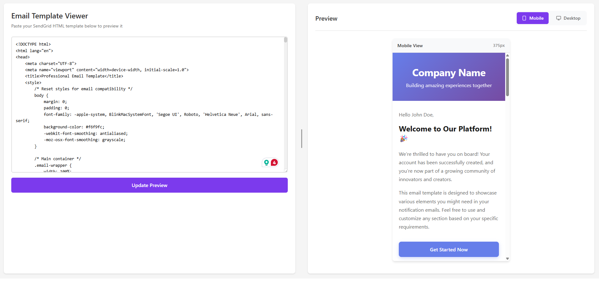

# Email Template Viewer - Helper Application

A .NET 8 Blazor Server application for previewing SendGrid email templates with side-by-side mobile and desktop views.

## 📸 Application Preview



*The application interface showing the HTML input editor on the left and mobile preview on the right*

## 🚀 Quick Start

```bash
cd EmailTemplateViewer
dotnet run
```

Then open your browser to the URL shown (typically `https://localhost:5001`)

## 📋 What This Does

This application provides a simple, single-page interface where you can:

1. **Paste** any HTML email template (like those from SendGrid)
2. **Preview** how it looks on mobile devices (always visible)
3. **Optionally view** desktop rendering (toggle on/off)
4. **Compare** mobile vs desktop side-by-side

## 📱 Default Views

- **Mobile View**: 375px × 667px (iPhone-like dimensions) - **Always Visible**
- **Desktop View**: 1200px wide - **Optional** (enable via checkbox)

## 🎯 Use Cases

- Testing SendGrid email templates before sending
- Verifying responsive email design
- Comparing mobile vs desktop rendering
- Quick HTML email preview without sending test emails

## 📂 Project Structure

```
EmailTemplateViewer/
├── Components/
│   ├── Pages/
│   │   ├── Home.razor          # Main viewer page
│   │   ├── Home.razor.css      # Viewer styles
│   │   └── Error.razor         # Error page
│   ├── Layout/
│   │   ├── MainLayout.razor    # App layout
│   │   └── MainLayout.razor.css
│   ├── App.razor               # Root component
│   └── _Imports.razor          # Global imports
├── wwwroot/
│   ├── app.css                 # Global styles
│   └── lib/                    # Bootstrap files
├── sample-email.html           # Sample template to test
├── Program.cs                  # App entry point
├── README.md                   # Detailed documentation
└── QUICKSTART.md               # Quick start guide
```

## 🛠️ Technologies Used

- **.NET 8**: Latest .NET framework
- **Blazor Server**: Interactive web UI framework
- **Bootstrap 5**: CSS framework (minimal usage)
- **HTML/CSS**: Custom responsive design

## 📖 How to Use

1. Run the application
2. Copy your SendGrid HTML template
3. Paste it in the textarea on the left
4. Click "Update Preview"
5. Toggle "Show Desktop View" if needed
6. View your email in mobile (always) and optionally desktop format

## 🎨 Features

✅ Clean, modern UI  
✅ Mobile-first approach (mobile view always visible)  
✅ Optional desktop view  
✅ Responsive layout  
✅ Real-time preview updates  
✅ No database or external dependencies  
✅ Lightweight and fast  

## 📝 Notes

- The mobile view uses iframe rendering to show exact HTML output
- Desktop view can be toggled on/off to save screen space
- Sample email template included for testing (`sample-email.html`)
- Perfect for development and testing workflows

## 🔧 Requirements

- .NET 8 SDK or later
- Modern web browser (Chrome, Edge, Firefox, Safari)

## 📄 License

This is a helper application for internal use.

